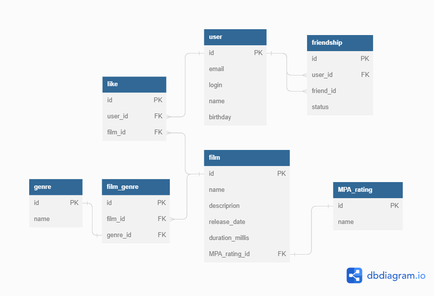

# java-filmorate
Template repository for Filmorate project.


```
-- запрос возвращает имена фильмов, которые нравятся друзьям пользователя с id = 1
SELECT name
FROM film
WHERE id IN (
  -- подзапрос возвращает id фильмов друзей пользователя
  SELECT id
  FROM like
  WHERE user_id IN (
    -- подзапрос возвращает id друзей пользователя
    SELECT friend_id
    FROM friendship
    WHERE user_id = 1 AND status = true
  )
)
```

```
-- запрос возвращает названия пяти самых популярных фильмов
SELECT name
FROM film
WHERE id IN (
  -- подзапрос возвращает id 5 популярных фильмов
  SELECT film_id
  FROM like
  GROUP BY film_id
  ORDER BY COUNT(user_id) DESC
  LIMIT 5
);
```

```
-- запрос возвращает id общих друзей пользователей с id 1 и 4
SELECT friend_id
FROM friendship
WHERE user_id = 4 AND status = true AND friend_id IN (
  -- запрос возвращает id друзей пользователя
  SELECT friend_id
  FROM friendship
  WHERE user_id = 1 AND status = true
);
```
